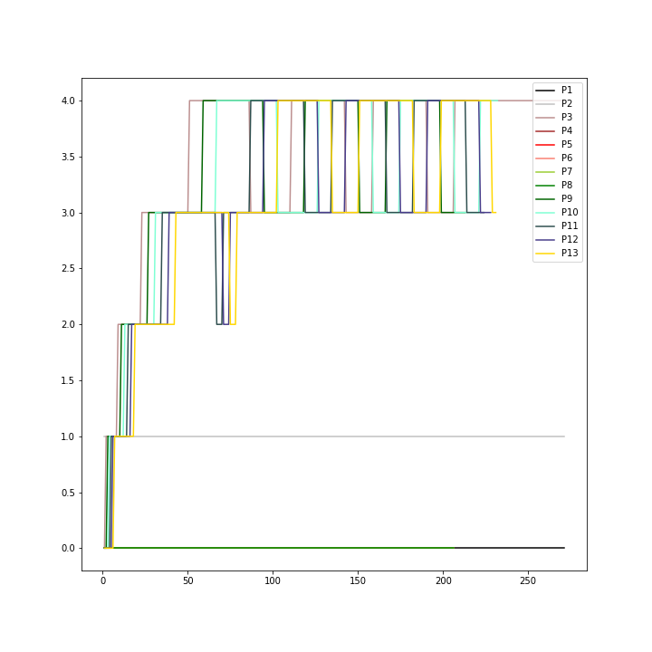
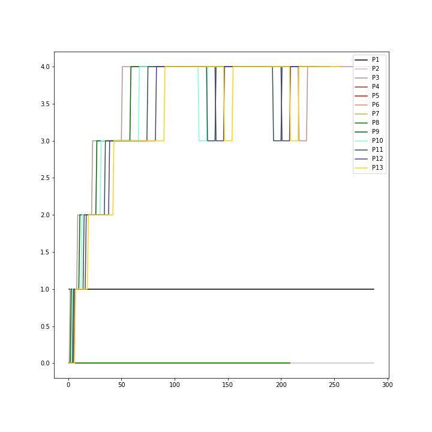

# OSN Assignment 4

**Name:** AKSHETT RAI JINDAL

**Roll Number**: 2019114001

## Overview of Work Done

1. `trace` systemcall to trace the execution of the systemcalls has been done
2. Schedulers that can be used:

| S.No. | Name                                 | MAKE FLAG                    | Preemption |
|-------|--------------------------------------|------------------------------|------------|
| 1.    | Round-Robin Scheduler                | `SCHEDULER=RNDRBN` (DEFAULT) | Yes        |
| 2.    | First-Come-First-Serve Scheduler     | `SCHEDULER=FCFS`             | No         |
| 3.    | Priority Based Scheduler             | `SCHEDULER=PBS`              | No         |
| 4.    | Multi-Level Feedback Queue Scheduler | `SCHEUDLER=MLFQ`             | Yes        |

1. `procdump` function has been modified and extra information has been added for the **PBS** and **MLFQ** schedulers.
2. **BONUS:** A graph of MLFQ scheduler has been generated for analysis.

## Further Details

### Trace (Systemcall Number 22)

* A new systemcall `trace` has been added to the kernel
* This can be used to print out information about specific systemcalls.
* A new variable called `tracemask` has been added to the process struct (`proc`):
    * It holds information about which systemcalls to trace
    * If we want to trace the systemcall number `i` (numbers defined in `kernel/syscall.h`), then
      set the `i`^th^ bit of the `tracemask` to 1 => `tracemask &= (1 << i)`
    * Hence, its default value is 0
    * This `tracemask` variable is taken as a parameter in the systemcall: `trace(new_mask)`
* A `sys_trace` function was added in `kernel/sysproc.h` which extracts the mask and calls the actual `trace`
  function in `kernel/proc.c`
* In `syscall` function in `kernel/syscall.c`, before calling the systemcall number `num`, the arguments were
  extracted and after calling the systemcall, the mask is checked and if the corresponding bit is set,
  the PID, systemcall name, arguments and return value are printed.
* A user-program named `strace` was added to test this systemcall. It takes atleast 2 arguments: the mask, and the command to run
* It forks a new process and then:
    * In the child process, it set the mask using `trace` syscall and the uses `exec` to execute the program.
    * In the parent process, it just uses `wait` to wait for the child process to finish executing.
* To maintain the mask throughout the forks, in the `fork` function in `kernel/proc.c`, I have set the tracemask
  of the new child process the same as that of the current parent process.

---

### Schedulers

#### First-Come-First-Serve Scheduler (Non-Preemptive)

* In this scheduler, we take the process which is in the `RUNNABLE` state and was
  created the earliest and let it run completely.
* For this, a new variable `ctime` was added in the `proc` struct.
* In the `allocproc` function, this value was set to `ticks` which is the number of
  ticks for which the OS has run till now.
* Then, in the `scheduler` function in the `kernel/proc.c` file, if the scheduler was set to FCFS:
    * I initialized a `oldest_proc` variable with 0 and it will hold the pointer to the process struct
      that will be run next.
    * We iterate through all the processes and keep on updating this value if a `RUNNABLE` process with
      smaller `ctime` is found.
    * Then this process is let run till its completed
* To prevent preemption, we have disabled it in `kernel/trap.c` in the `usertrap` and `kerneltrap` functions
  we have disabled the `yield()` function for FCFS.

#### Priority Based Scheduler (Non-Preemptive)

* In this scheduler, we calculate a dynamic priority from a static priority and niceness:
    * This niceness is the percentage of the time it was sleeping. It ranges from 0 to 10 (default 5).
    * The niceness is updated everytime after the process was scheduled and run.
    * The static priority is set to 60 by default and can have the range from 0 to 100.
    * The static priority and the niceness are stored in the proc struct.
    * To update the static priority, a `set_priority` systemcall has been implemented:
        * It takes two arguments: new priority and the pid of the process to be changed.
        * A user-program `setpriority` has been implemented.
    * After updating, the niceness, current run time (`pbsrtime`) and current sleep time (`stime`) are reset.
    * Also, if after the `set_priority` syscall, the new dynamic priority is more than the old
      one, the current run process is preempted.
* In the `scheduler` function:
    * I again initialized a `highest_priority_proc` variable to 0.
    * It was updated with the process having the most dynamic priority.
    * And then it was run.
    * After yielding, the niceness of the process is updated.

#### Multi-Level Feedback Queue Scheduler (Preemptive)

* In this scheduler, we have 5 queues, numbered 0 to 4, with decreasing priorities.
* They are available in the kernel as `proc_queue[queue_number]`.
* Each queue also has an allotted `timeslice = 1 << queue_number` after which the process running
  from the queue will be preempted.
* Every new process enters the queue number 0.
* In the scheduler, I first check for **starvation** through **ageing**:
    * A variable `cqwtime` has been added to proc struct for storing "current queue wait time"
    * I iterate through the queue number 1 to 4 and if for any process, the `cqwtime` value is more than
      `STARVATION_TICKS_LIMIT` (defined in `kernel/param.h`), it is removed from the current queue and moved to
      one queue up.
    * Then I again iterate through the queues 0 to 4 and look for the first `RUNNABLE` process.
    * Upon being found, it is scheduled to run till one of the following happens:
        1. It exhausts the `timeslice`:
            * In this case, if the process is not in queue 4, it is moved one queue down.
            * To check it, a variable `has_overshot` is added to proc struct and
              over-shooting is checked in `update_time` function implemented in
              the tutorial for `waitx`.
        2. Another process is added to a queue which has higher priority than the queue of the
           current process:
            * In this case, the process is pushed back into its current queue.
            * It is checked by seeing the state (== `RUNNABLE`) after yielding.
        3. It finishes execution:
            * In this case it is completely removed from the queues.
        4. It gives up CPU for some I/O or sleep:
            * In this case, it is removed from the queues, and after it wakes up, it pushed back
              into the queue in which it was before sleeping.
            * This is done in the `wakeup` function in the `kernel/proc.c` file
* For addition and removal from the queues, I have added two new functions in `kernel/proc.c` named
  `add_to_proc_queue` and `remove_from_proc_queue`. Both take proc struct pointer and the queue number:
    * The `add_to_proc_queue` resets the variables that store the information related to queue like
      `cqrtime` (the time it has run in this queue), `cqwtime` (the time it has spent in `RUNNABLE` state
      in its current queue), `has_overshot` (whether it has exceeded the timeslice) to 0.

---

### Procdump

* The `procdump` function has been modified for PBS and MLFQ scheduler.
* This function prints the information about current processes upon pressing `Ctlr+P`.

#### For PBS

| Field      | Description                                                        |
|------------|--------------------------------------------------------------------|
| `PID`      | The PID of the process                                             |
| `Priority` | The dynamic priority of the process                                |
| `State`    | The current state of the process                                   |
| `rtime`    | The time for which the process has used CPU till now               |
| `wtime`    | The time for which the process has waited for CPU till now         |
| `nrun`     | The number of times the process has been scheduled to run till now |

#### For MLFQ

| Field      | Description                                                                     |
|------------|---------------------------------------------------------------------------------|
| `PID`      | The PID of the process                                                          |
| `Priority` | The queue number of the process (-1 if the process is in `ZOMBIE` state)        |
| `State`    | The current state of the process                                                |
| `rtime`    | The time for which the process has used CPU till now                            |
| `wtime`    | The time for which the process has waited for CPU till now in the current queue |
| `nrun`     | The number of times the process has been scheduled to run till now              |
| `q_i`      | The total time the process has spent in the i^th^ queue till now                |

---

### Bonus

* For bonus, a graph for MLFQ scheduler was made in which, the time taken by processes in each queue was captured
* For this, the `schedulertest.c` file was used provided by the TAs with slight modifications
* To extract data:
  * `procdump()` was called as each clock interrupt
  * `schedulertest` user-program was run and the output was extracted using `tee` command.
* Then it was cleaned manually and parsed using python code (in the `bonus/` folder).
* **NOTE: THE QUEUE NUMBERS ARE FROM 0 TO 4**
* With the `STARVATION_TICKS_LIMIT` set as 30 (`30_output.png`):
  1. The processes with PID 11, 12, and 13 (CPU intensive task) starved in queue number 3 and were sent to queue 2.
  2. After moving to queue number 4, they kept on overshooting and starving to move between the queue 3 and 4 with high frequency due to lower .
  3. The processes from PID 4-8 (I/O intensive processes) remained in the queue 0 for the whole time because they were sleeping the whole time and did not request any CPU control.
  4. The parent process (PID = 3) first was a CPU intensive process (see modified `schedulertest.c`) and after that kept on waiting for the child processes. So
     it also was overshooting and finally moved to queue 4 where it oscillated like the other CPU intensive processes.
  5. In the lower queues (number 0, 1 and 2), the processes overshoot by completely
     using their timeslices and move to next queue. This happens because the
     timeslice allowed in those queues are very small (1, 2 and 4 respectively).
  6. Hence, there is no scope of starving when the number of processes is so small. If the
     number of processes is increased by a lot, then the processes may start starving
     in these queues as well.

* With the `STARVATION_TICKS_LIMIT` set as 50 (`50_output.png`):
  1. This time, the STARVATION_TICKS_LIMIT was so high that the processes did not get to reach the starve limit when in queue 3.
  2. This time again after reaching the queue 4, they kept overshooting and starving.
     So, they again oscillated between queue 3 and 4 but this time with lower frequency
     as it took time to reach the starvation limit.
  3. The processes from PID 4-8 (I/O intensive processes) remained in the queue 0 for the whole time because they were sleeping the whole time and did not request any CPU control.
  4. The parent process (PID = 3) first was a CPU intensive process (see modified `schedulertest.c`) and after that kept on waiting for the child processes. So
     it also was overshooting and finally moved to queue 4 where it oscillated like the other CPU intensive processes.
  5. In the lower queues (number 0, 1 and 2), the processes overshoot by completely
     using their timeslices and move to next queue. This happens because the
     timeslice allowed in those queues are very small (1, 2 and 4 respectively).
  6. Hence, there is no scope of starving when the number of processes is so small. If the
     number of processes is increased by a lot, then the processes may start starving
     in these queues as well.

---

### Sleeping in MLFQ

**The question was that as the processes which wake up after sleeping or I/O related process, then they are
pushed to the back of the same queue from which they were removed before giving up the CPU. Can this be exploited
by the processes in any way?**

**Answer:** Yes, this can be exploited by the process to never get removed from the queue in which it is present currently.
The process can deliberately go to sleep for a short duration just before its timeslice of 2^(queue_number) is about to end.
This way after the small sleep it will be pushed back into the same queue and thus will soon be scheduled to run or even move
to an upper queue due to ageing. This way the process can spoof the CPU to think that it is a high priority process which need
I/O but in reality the process may just be CPU bound.

---

### Benchmarking

**Note:** In these tests, the age limit for starvation was set to 60 ticks.
The number of CPUs used was 1.

#### Data

1. Number of I/O processes = 5 (0 for FCFS), Number of CPU intensive processes = 5 (10 for FCFS)

| Scheduler                  | Avg. Run Time | Avg. Wait Time |
|----------------------------|--------------:|---------------:|
| Round-Robin                |            19 |            200 |
| First-Come-First-Serve     |            40 |            262 |
| Priority Based             |            20 |            264 |
| Multi-Level Feedback Queue |            20 |            196 |

2. Number of I/O processes = 10 (0 for FCFS), Number of CPU intensive processes = 10 (20 for FCFS)

| Scheduler                  | Avg. Run Time | Avg. Wait Time |
|----------------------------|--------------:|---------------:|
| Round-Robin                |            19 |            302 |
| First-Come-First-Serve     |            38 |            443 |
| Priority Based             |            19 |            284 |
| Multi-Level Feedback Queue |            19 |            286 |

#### Analysis

* The average wait time in MLFQ is the least in the first case and does not increase as much as it does
  for the other schedulers.
* The average wait time for FCFS is one of the highest in the first case and in the second case it exceeds
  the rest by a huge gap. This is because the processes in FCFS keep on running according to their creation
  time and there is no preemption. Hence, the rest of the processes have to keep waiting for the processes to
  give up the CPU.
* The PBS seems to remain the most constant in terms of both the avg wait time and the avg run time. The average
  wait time increases but not by much. This happens because in my `schedulertest`, the priorities of some processes
  were changed which caused the processes to be preempted and hence the other processes had to wait less time
  for CPU.
* The round robin has avg wait time close to the MLFQ but always a bit more than it. The processes are preempted
  after every clock interval, so the processes have to wait very less for the CPU.
* The round robin and MLFQ are performing the best in terms of the wait times as they both preempt the processes after
  some fixed interval(s) and the MLFQ implements things like ageing to prevent starvation and overshooting to do better
  distribution of the CPU cycles among the processes.
* In the terms of the average run times, all the schedulers except FCFS have similar performance. The run times remain
  almost constant independent of the number of processes. This shows that the run time is something that is the property
  of the process and not of the scheduler.
* Here the FCFS has a bit more average run time than the others because all the processes that were run in the FCFS were
  CPU intensive and none of them did any I/O or sleep. So, the average run time increased.

* By this data MLFQ seems a better option that round robin because it has lesser average wait times. But Round Robin scheduling
  is preferred as the processes can exploit the CPU in MLFQ by deliberately sleeping or doing IO just before its timeslices are
  going to end. That will lead to unfair distribution of CPU time among the processes.
